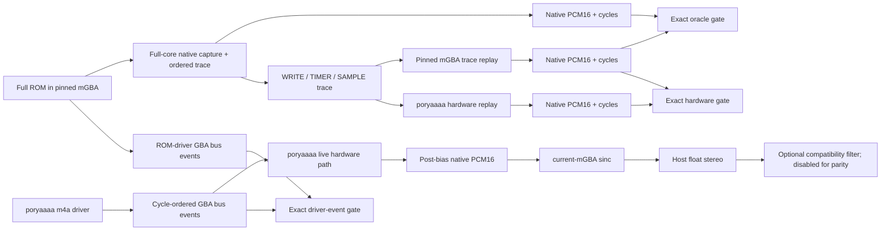

# Audio Parity Correction Plan — poryaaaa vs pinned mGBA

Updated: 2026-08-11
Current poryaaaa baseline: `a2de4c2`
Reference mGBA revision: `afd6f14eaf8bd35214ed3fb9dc69a92bfc3877a9`
Scope: `packages/poryaaaa` driver, native hardware output, frontend resampling, and shipped output paths
Harness specification: `packages/poryaaaa/docs/arch-parity-fix-plan.md`
Prior evidence:

- `.scratch/mgba-sq2-parity/CONTEXT.md`
- `.scratch/directsound-parity/HANDOFF.md`
- `packages/poryaaaa/docs/v2-resonance-suppression-research.md`

## 1. Goal and evidence boundaries

Make poryaaaa produce the same audio as the pinned mGBA build for the same ROM and playback state. Keep three questions separate:

1. **Hardware parity:** Does poryaaaa produce the same post-bias native stereo PCM16 for the same ordered GBA audio events?
2. **Driver parity:** Does poryaaaa's m4a driver emit the same register, Wave RAM, FIFO, and timer events as the ROM driver?
3. **Frontend parity:** Given identical native PCM, does poryaaaa produce the same host-rate stream as mGBA?

A failure in one boundary must not be attributed to another. Whole-song parity is not established until all three pass.

The native gate is exact: same frame count, sample cycle, signed left PCM16, and signed right PCM16. Lag search, DC removal, gain fitting, normalization, correlation, and residual percentages are diagnostic only and cannot pass a gate.

## 2. Execution result

The reachable hardware and frontend work is complete. Whole-engine parity remains blocked at the driver-timing boundary; later output tuning cannot legitimately hide that failure.

### Passed exact gates

- Phase 0: two full-ROM captures are byte-identical, and replaying the captured trace through the pinned mGBA clone matches all 81,920 native frames exactly. Provenance: `.scratch/arch-fix/evidence/oracle/provenance.json`.
- Phases 1–3: reset, SQ1, SQ2, noise, Wave, FIFO A, FIFO B, combined PSG, and combined full mix all match pinned mGBA in frame count, cycle, signed left PCM16, and signed right PCM16. Report: `.scratch/arch-fix/evidence/matrix/matrix-final.json`.
- Phase 4 hardware seam: production rendering consumes canonical cycle-ordered FIFO writes and timer events; the software ring/PUBLISH approximation is gone. Trace contracts cover 32-byte FIFO state, little-endian DMA words, timer selection, reset, underflow, routing, and same-cycle order.
- Phase 6: the direct pinned-mGBA frontend harness passes 10,567/10,567 comparisons at 65,536, 48,000, and 44,100 Hz across whole, one-frame, and 37-frame partitions. Report: `.scratch/arch-fix/evidence/frontend/gate.json`.
- Comparator self-tests pass 11/11, hardware trace contracts pass, and the package unit suite passes 8,777/8,777.

### Blocked exact gate

- Phase 5 fails at driver record 2: pinned ROM emits a `WRITE`; the software driver emits a `TIMER`. Evidence: `.scratch/arch-fix/evidence/driver-gate.json`.
- The pinned ROM's SoundMain writes have path-dependent offsets of 2,808–7,483 cycles from VBlank and 31–350-cycle intra-write gaps. The software driver represents logical VBlank/sample time but does not execute ARM instructions, so it cannot derive those cycles without a timing-aware ARM7TDMI source.
- Fixture-specific offsets are prohibited. The required redesign is to feed the event seam from execution of the ROM MP2K driver under an ARM timing model, or another source that preserves the same instruction and IRQ timing.
- Phase 7 renderer capture is valid and free of the removed inert analog-filter option, but exact whole-song comparison fails because Phase 5 fails. Report: `.scratch/arch-fix/evidence/renderer-gate.json`.

## 3. Correct comparison architecture



The trace replay path is the hardware oracle. The production driver path must eventually consume the same cycle-domain event contract; `PCM_PUBLISH` and `PCM_RESET` must not be disguised as GBA registers.

## 4. Target architecture

- One integer GBA-cycle timebase spans driver events, hardware writes, FIFO consumption, and native samples.
- `M4ARegWrite` events carry cycle-domain time. Host frames are an output concern, not the source of hardware event timing.
- PSG, Wave, FIFO, and mixer state advance to the event cycle before applying the event.
- The m4a software mixer may retain an internal ring as its source buffer, but the hardware boundary receives real FIFO A/B writes and selected TIMER events. The same FIFO implementation serves trace replay and live rendering.
- Native channel and mix arithmetic follows the pinned mGBA operation order and integer widths through SOUNDBIAS clipping and PCM16 publication. Float conversion happens only at the frontend boundary.
- The frontend remains the current mGBA sinc unless a matched native-equal/frontend-different capture proves a streaming-semantics discrepancy.
- Parity mode disables the optional analog filter, fade, gain fitting, normalization, and other post-processing.

## 5. Execution plan

Each phase has a hard gate. Do not proceed past a failed prerequisite by tuning a later stage.

### Phase 0 — Validate provenance and the mGBA oracle

Role: dispatch a `task` implementer for captures; require a `reviewer` for source provenance and artifact validation.

1. Build against an explicit `PORYAAAA_MGBA_SOURCE` worktree at the pinned revision with only the reviewed observation patch.
2. Capture the same full-ROM fixture twice with `--capture-stage both`.
3. Require identical trace, native PCM, cycle, and manifest hashes across the two runs.
4. Replay that trace through `mgba_audio_trace_replay`.
5. Compare `mgba-full.json` against `mgba-clone.json` using `native_compare.py`.
6. Archive the command line, ROM/BIOS hashes, mGBA revision, observation-patch hash, compiler flags, and three artifact manifests.

Gate:

- Full mGBA and the separate mGBA replay match exactly.
- If they do not, stop and fix the harness. No poryaaaa emulation change is valid evidence before this gate passes.

### Phase 1 — Record the current hardware matrix without tuning

Role: dispatch a `task` implementer for the matrix; use a `reviewer` to classify first divergences.

Run in this order:

1. Reset silence.
2. SQ1 solo.
3. SQ2 solo.
4. Noise solo.
5. Wave solo.
6. FIFO A solo.
7. FIFO B solo.
8. Combined PSG.
9. Combined full mix.

For every case:

1. Replay the same oracle trace through `mgba_audio_trace_replay` and `poryaaaa_audio_trace`.
2. Run `native_compare.py` with no signal conditioning.
3. Record the first differing input event, sample cycle, expected/actual signed L/R values, and relevant channel/mixer/FIFO state.
4. Retain correlation, residual, lag, and RMS only as diagnostics after the exact comparison fails.

Gate:

- Produce one baseline report containing exact pass/fail status for all cases.
- Select the next fix from the earliest observed divergence, not from perceived timbre.

### Phase 2 — Move the production path onto integer cycle time

Role: dispatch a `task` implementer; require a `reviewer` for overflow, chunk-boundary, and event-order analysis.

1. Replace host-frame `M4ARegWrite.sample_offset` as the hardware timing contract with render-relative or absolute GBA cycles.
2. Stamp VBlank and all same-VBlank register events in one stable `(cycle, order)` domain.
3. Advance the live hardware path to each event cycle before applying the event, matching trace replay semantics.
4. Replace `HwPcm.pcm_pos` and `quirk_pos` doubles with integer/rational phase accumulators. Preserve exact long-run rates without floating-point floor decisions.
5. Keep host-frame conversion only where native samples enter `hw_resample`.
6. Perform a clean cutover: update all callers and tests; do not leave a float fallback or parallel timing API.

Gate:

- Equivalent renders are invariant across host block sizes, including boundaries around VBlank, register writes, and SOUNDBIAS changes.
- Cycle-domain driver events are deterministic across repeated runs.
- Re-run Phase 1; no previously exact hardware case regresses.

### Phase 3 — Reproduce mGBA integer mix and SOUNDBIAS semantics

Role: dispatch a `task` implementer for `hw_mix`; require a `reviewer` to compare every arithmetic step with pinned `src/gba/audio.c`.

1. Define the native per-channel sample domain and signed widths from the pinned mGBA source.
2. Reproduce NR50/NR51, SOUNDCNT_H PSG/DMA volume, routing, master-volume multiplication, shift/truncation, SOUNDBIAS addition, `[0, 0x3FF]` clipping, bias subtraction, and PCM16 publication in the same order and integer widths.
3. Convert to float only when feeding `hw_resample`; do not round-trip native arithmetic through float.
4. Replace normalized-maximum-only tests with exact signed stereo vectors covering:
   - every PSG volume code;
   - NR50 codes `0` and `7`;
   - DMA 50% and 100%;
   - independent L/R routing;
   - positive and negative SOUNDBIAS clipping;
   - combined six-channel sums at both clip boundaries.

Gate:

- The first hardware mismatch attributable to sample value or clipping is eliminated exactly.
- `native_compare.py` passes affected Phase 1 cases without normalization or gain fitting.

### Phase 4 — Replace the publish approximation with FIFO/timer events

Role: dispatch a `task` implementer for the driver/hardware boundary; require a `reviewer` for DMA refill ordering and underrun behavior.

1. Keep `M4APcmRing` only as the software m4a mixer's source buffer if it remains useful.
2. Convert produced PCM bytes into actual little-endian 32-bit FIFO A/B writes at the hardware boundary.
3. Schedule TIMER 0/1 consumption from SOUNDCNT_H selection in GBA-cycle time.
4. Model the 32-byte FIFO, threshold/refill order, empty hold, reset, and same-cycle DMA-write-before-consume semantics using the implementation already exercised by trace replay.
5. Route the live engine through that FIFO path; remove `M4A_REG_PCM_PUBLISH`/`PCM_RESET` from the hardware contract and update every caller.
6. Extend `m4a_driver_trace` so DirectSound produces canonical FIFO WRITE and TIMER events rather than reporting the mapping unavailable.

Gate:

- FIFO A/B native cases pass exactly, including independent stereo routing, timer selection, reset, underrun hold, same-cycle order, and little-endian word order.
- Driver trace can represent DirectSound without implementation-only events.
- The 12-voice DirectSound fixture improves from the current diagnostic failure to exact native equality; correlation/residual are progress metrics only.

### Phase 5 — Close ROM-driver versus poryaaaa-driver parity

Role: dispatch a `task` implementer for first-divergence fixes; use a separate `reviewer` for every accepted event-contract change.

1. Compare ROM and poryaaaa traces by event kind, cycle, order, address, width, and value.
2. Fix one first divergence at a time in this order of responsibility:
   - parser/command scheduling;
   - VBlank and event timing;
   - CGB register and Wave RAM writes;
   - PCM voice interpolation and envelope state;
   - `sound_main_ram_reverb()` output;
   - FIFO payload and timer scheduling.
3. Add a behavior test for each fixed divergence. The test must fail on the observed wrong event or sample sequence.
4. Specifically reproduce and correct the known note-off/envelope `255 -> 243` versus ROM `255 -> 187 -> 178` divergence.
5. Do not tune the inactive `M4AReverb` object; diagnose active reverb in `m4a_pcm.c` through emitted FIFO bytes.

Gate:

- Driver traces match exactly for the accepted fixture matrix.
- Feeding the matched driver trace through the already-passing hardware path produces exact native PCM.

### Phase 6 — Verify frontend streaming semantics

Role: dispatch a `task` implementer for captures; use a `reviewer` to compare the pinned mGBA resampler source and stream boundaries.

Prerequisite: native PCM and sample cycles are already exact.

1. Keep the existing current-mGBA sinc kernel.
2. Compare matched native input through poryaaaa and mGBA at `65536`, `48000`, and `44100` Hz.
3. Verify startup zero-padding, source/destination timestamps, high/low-water behavior, chunk boundaries, final buffered samples, PCM16 conversion, and independent stereo state.
4. Do not add a low-pass, DC blocker, EQ, limiter, resonance suppressor, or gain correction unless the first frontend mismatch proves that exact operation exists in the pinned mGBA output path.
5. Update stale `blip_buf` documentation only after the frontend gate passes.

Gate:

- Matched native input produces matched frontend output at every accepted sample rate and block-size partition.

### Phase 7 — Align the shipped renderer path and close whole-song parity

Role: dispatch a `task` implementer for renderer path consistency; require a `reviewer` for end-to-end acceptance evidence. CLAP capture is out of scope.

1. Define one parity profile: analog filter off, no fade, no output normalization, fixed sample rate, fixed channel mask, fixed ROM/voicegroup/MIDI hashes.
2. Exercise the shipped renderer path: `poryaaaa_render -> m4a_advance() -> hw_audio_render_events()`.
3. Resolve the renderer's inert `--analog-filter` contract: either route it through the actual filter or remove the option. The parity profile remains filter-off.
4. Compare full-song native and frontend artifacts with independent L/R channels.
5. Perform listening tests only after exact gates pass; listening can detect missing test coverage but cannot override artifact mismatches.

Gate:

- The complete native matrix expands from the previously reported isolated coverage to all reset, PSG, Wave, FIFO, combined, and full-song fixtures with exact L/R equality.
- Driver event traces match for the same fixtures.
- Frontend captures match at the selected shipped sample rates.
- The renderer uses the documented parity profile without hidden post-processing.

## 6. Required verification commands

Use the existing package build directory only:

```bash
cd packages/poryaaaa
cmake -B build \
  -DPORYAAAA_MGBA_SOURCE=/absolute/path/to/pinned-mgba-worktree
cmake --build build --target \
  poryaaaa_audio_trace \
  mgba_mp2k_reference \
  mgba_audio_trace_replay \
  poryaaaa_render \
  poryaaaa_unit_tests

python3 tools/mgba-reference/test_native_compare.py
./build/poryaaaa_unit_tests

./build/mgba_audio_trace_replay \
  --input /tmp/case.trace \
  --output-prefix /tmp/case-mgba
./build/poryaaaa_audio_trace \
  --input /tmp/case.trace \
  --output-prefix /tmp/case-poryaaaa \
  --solo all
python3 tools/mgba-reference/native_compare.py \
  /tmp/case-mgba.json \
  /tmp/case-poryaaaa.json
```

The full-ROM recorder command is fixture-specific. Record the exact invocation beside its artifacts rather than placing a guessed command in this plan.

## 7. Stop conditions

Stop the current phase and fix its prerequisite if any of these occurs:

- Full mGBA and its replay adapter differ by one cycle or one PCM16 value.
- Repeated oracle runs produce different hashes.
- Native pass/fail changes after lag, gain, DC, mono, or normalization processing.
- An installed-library frontend capture is presented as authoritative native evidence.
- Driver `PCM_PUBLISH` or `PCM_RESET` signals are presented as GBA register events.
- A FIFO timer event cannot establish DMA-write-before-consume order.
- Frontend or filter tuning begins before native and driver gates pass.
- A whole-song claim relies only on isolated-channel or short-window evidence.

## 8. Non-goals

- No resonance EQ, per-song gain, or parameter tuning to hide a native mismatch.
- No new resampler while the current mGBA sinc remains source-matched.
- No reverb retune before driver FIFO bytes prove reverb is the first divergence.
- No alternate timing API, compatibility fallback, or permanent feature flag after a phase passes.
- No dependency consolidation, vendored-source formatting, or unrelated engine cleanup.

## 9. Deliverables

The correction is complete only when the repository contains or references:

1. Provenance records and deterministic full-mGBA native artifacts.
2. A bit-exact full-mGBA versus mGBA-replay oracle result.
3. Exact hardware-matrix results with first-divergence evidence for every failure.
4. Exact ROM-driver versus poryaaaa-driver trace results, including DirectSound.
5. Exact frontend comparisons at the accepted sample rates.
6. Tests defending every corrected arithmetic, timing, FIFO, and event-order contract.
7. An end-to-end renderer capture using the documented parity profile.

Until items 2-5 pass, the accurate claim is: **poryaaaa implements and tests many mGBA-derived hardware contracts, but whole-engine audio parity is not yet proven.**
