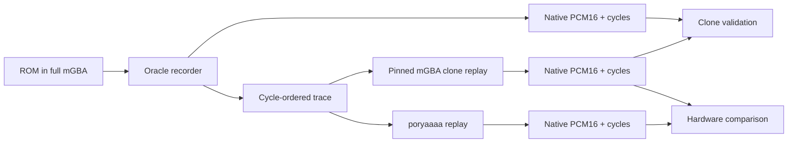

# Native Audio Comparison Plan — pinned mGBA vs poryaaaa

Date: 2026-08-10
Scope: comparison infrastructure only; no emulator tuning
Reference revision: mGBA `afd6f14`
Poryaaaa package: `packages/poryaaaa`

## 1. Goal

Produce one deterministic, cycle-ordered GBA audio trace from a full mGBA ROM
run, replay it through a pinned clone of mGBA's audio implementation and through
poryaaaa, then compare native stereo integer output exactly.

The harness must answer three separate questions:

1. Did the mGBA clone replay the full mGBA run exactly?
2. Did poryaaaa produce the same hardware output for the same hardware events?
3. Did poryaaaa's software m4a driver produce the same hardware events as the
   ROM's compiled m4a driver?

Question 1 is the oracle-validation gate. Question 2 is hardware parity.
Question 3 is driver parity. A failure in one must not be reported as a failure
in another.



## 2. Non-negotiable comparison contract

### 2.1 Time and ordering

- Clock: exactly `16,777,216` GBA cycles per second.
- Every event has an absolute `uint64` cycle.
- Every event has a strictly increasing same-cycle `uint32` order.
- Samples are explicit trace events. Neither replay adapter infers sample timing
  from a host sample rate.
- Events before `BEGIN` establish state but are excluded from measured output.
- `END` closes the only measurement interval.

### 2.2 Trace grammar

The poryaaaa reader already consumes this versioned text contract:

```text
PORYAAAA_AUDIO_TRACE 1
CLOCK 16777216
WRITE <cycle> <order> <width> <gba-address-hex> <value-hex>
TIMER <cycle> <order> <0-or-1>
BEGIN <cycle> <order>
SAMPLE <cycle> <order>
END <cycle> <order>
```

`WRITE` payloads are little-endian GBA bus values. Required addresses:

- `0x04000060` through `0x04000088`: audio control registers.
- `0x04000090` through `0x0400009F`: visible Wave RAM window.
- `0x040000A0`: FIFO A, 32-bit writes.
- `0x040000A4`: FIFO B, 32-bit writes.

`TIMER` is emitted at the DirectSound byte-consumption point. If a timer
underflow requests DMA, the resulting FIFO writes must appear first at that
same cycle with lower order values. This flattens mGBA's synchronous DMA call
without changing the order seen by the audio module.

### 2.3 Capture artifacts

Each adapter writes sibling files with one prefix:

- `.pcm`: interleaved little-endian signed PCM16, left then right.
- `.cycles`: one little-endian `uint64` GBA cycle per stereo frame.
- `.json`: canonical capture manifest.

Required manifest fields:

```json
{
  "format": "poryaaaa-native-capture",
  "version": 1,
  "source": "mgba-full | mgba-clone | poryaaaa",
  "clock_hz": 16777216,
  "channels": 2,
  "sample_format": "s16le",
  "cycle_format": "u64le",
  "frame_count": 1,
  "first_cycle": 0,
  "last_cycle": 0,
  "solo_mask": 63
}
```

The mGBA manifests must additionally record:

- Exact git commit.
- Dirty-tree state and patch hash.
- Compiler identity and flags.
- ROM SHA-256.
- BIOS path/hash or explicit HLE mode.
- Audio channel mask.
- mGBA master volume.
- Trace SHA-256.

### 2.4 Gate semantics

The native hardware gate requires:

- Same clock.
- Same frame count.
- Same cycle for every frame.
- Same signed PCM16 left sample for every frame.
- Same signed PCM16 right sample for every frame.

No mono fold, onset alignment, lag search, DC removal, gain fitting, polarity
correction, or amplitude normalization is allowed. Those remain diagnostic
operations in `waveform_compare.py` after the exact gate fails.

## 3. Existing poryaaaa-side seam

The mGBA work must target these checked-in poryaaaa interfaces rather than
inventing a second format:

- `plugin/hw_audio/hw_audio_trace.h`
  - `HwAudioTraceEvent`
  - `hw_audio_trace_reset()`
  - `hw_audio_trace_apply()`
- `cmd/poryaaaa_audio_trace.c`
  - trace-file validation and replay
  - native `.pcm`, `.cycles`, and `.json` output
- `tools/mgba-reference/native_compare.py`
  - exact cycle/stereo comparison
  - first mismatch and artifact hashes

Build and replay:

```bash
cd packages/poryaaaa
cmake -B build
cmake --build build --target poryaaaa_audio_trace
./build/poryaaaa_audio_trace \
  --input /tmp/reference.trace \
  --output-prefix /tmp/poryaaaa-native \
  --solo all
```

## 4. mGBA source policy

Use a dedicated clone checked out at `afd6f14`. Do not build against an
arbitrary package-manager `libmgba` for parity evidence.

Recommended layout outside generated build output:

```text
<workspace>/mgba-audio-reference/   # clone at afd6f14 plus reviewed patch
packages/poryaaaa/build/            # poryaaaa and reference binaries
```

CMake receives the clone explicitly:

```text
-DPORYAAAA_MGBA_SOURCE=/absolute/path/to/mgba-audio-reference
```

Do not copy or translate arithmetic into the recorder. Keep mGBA's PSG, GBA
mixer, timing scheduler, FIFO logic, and bias arithmetic compiled from the
pinned source. Harness changes must be observation or dependency seams only.
Retain MPL-2.0 notices in every modified/copied mGBA source.

## 5. Implementation phases

### Phase A — Pin and reproduce unmodified mGBA

Role: dispatch a `task` implementer; use a `reviewer` for provenance review.

1. Clone mGBA and checkout `afd6f14` detached.
2. Record commit, dirty state, compiler, and build flags in recorder output.
3. Change `packages/poryaaaa/CMakeLists.txt` reference configuration to require
   `PORYAAAA_MGBA_SOURCE` for native parity targets.
4. Keep the existing installed-library recorder available only for legacy
   frontend WAV diagnostics; label its output non-authoritative.
5. Capture one existing ROM fixture twice and require identical hashes.

Acceptance:

- Two unmodified full-ROM runs produce identical native PCM and trace hashes.
- The manifest identifies the exact source revision and ROM.
- A dirty or wrong mGBA checkout makes the native target fail configuration.

### Phase B — Add an observation sink to mGBA

Role: dispatch a `task` implementer familiar with C timing code; review with a
`reviewer` before accepting any edit in mGBA arithmetic.

Target mGBA files:

- `include/mgba/internal/gba/audio.h`
- `src/gba/audio.c`
- `src/gba/timer.c` only if the audio callback lacks the timer identity
- `src/gba/dma.c` only if FIFO writes bypass the observable audio entrypoint

Add a nullable trace sink owned by `GBAAudio`. The sink receives normalized
records but never controls emulation. No callback may allocate, perform file
I/O, or change event scheduling.

Required observation points:

1. Audio register entrypoints:
   - `GBAAudioWriteSOUND1CNT_*`
   - `GBAAudioWriteSOUND2CNT_*`
   - `GBAAudioWriteSOUND3CNT_*`
   - `GBAAudioWriteSOUND4CNT_*`
   - `GBAAudioWriteSOUNDCNT_*`
   - `GBAAudioWriteSOUNDBIAS`
2. `GBAAudioWriteWaveRAM` after its `GBAudioRun` ordering point.
3. `GBAAudioWriteFIFO` for actual 32-bit FIFO writes, including DMA writes.
4. `GBAAudioSampleFIFO` after any synchronous DMA refill and immediately before
   the FIFO byte is consumed. Emit `TIMER` there.
5. The sample loop inside `GBAAudioSample` after `_applyBias` writes
   `currentSamples[sample]`. Emit `SAMPLE` with the logical sample cycle, not
   the later frontend-buffer callback time.
6. `GBAAudioReset` to reset the sink's cycle/order tracker without clearing the
   caller-owned sink.

Ordering rule:

- Maintain one `(last_cycle, next_order)` counter in the sink adapter.
- Reset `next_order` when the cycle changes.
- An emitted sample caused by `GBAAudioSample()` precedes the register write
  that triggered that sample flush.
- DMA-generated FIFO writes inside `GBAAudioSampleFIFO()` precede its `TIMER`
  event.

Acceptance:

- Enabling the sink does not change a frontend WAV or native PCM hash.
- Disabling the sink executes no callback and requires no allocation.
- Trace positions are strictly ordered.
- Register and FIFO payloads match mGBA's input values exactly.

### Phase C — Extend the full-ROM oracle recorder

Role: dispatch a `task` implementer; use a `sonic` implementer for mechanical
manifest fields after the capture contract is fixed.

Target poryaaaa file:

- `tools/mgba-reference/mgba_mp2k_reference.c`

Add:

```text
--capture-stage frontend|native|both
--trace-output PATH
--native-output-prefix PATH
```

Native mode requirements:

- Attach the mGBA observation sink before reset.
- Replay all setup events into the trace.
- Emit `BEGIN` only at the current recorder capture-start point.
- Emit `END` at an exact GBA cycle, not after an approximate frontend frame
  count.
- Write PCM16 and cycle artifacts directly from logical `SAMPLE` observations.
- Continue supporting channel solo/mute through the same six-bit mask.
- Preserve the existing `postAudioBuffer` path only for `frontend` captures.

Acceptance:

- `native` mode never calls `blip_read_samples` for its measured PCM.
- SOUNDBIAS changes appear as register writes and changed SAMPLE cycle spacing.
- Left and right samples remain independent.
- Silent captures, missing markers, unordered events, and partial files fail.

### Phase D — Build the mGBA clone replay adapter

Role: dispatch a `task` implementer; require a `reviewer` to compare every
adapter call with the corresponding full-core call.

Create a standalone reference target in `tools/mgba-reference/` that links the
pinned clone and consumes the trace grammar from section 2.

Required behavior:

1. Initialize mGBA audio in hardware-reset state.
2. Apply register and Wave RAM events through mGBA's existing audio write
   functions.
3. Apply FIFO writes through `GBAAudioWriteFIFO`.
4. Disable autonomous DMA refills during replay; the trace already contains the
   FIFO writes generated by the oracle run.
5. Apply `TIMER` through the same FIFO-consumption logic used by timer overflow,
   without requesting a second DMA refill.
6. At every `SAMPLE`, expose the exact signed left/right value from mGBA's
   post-bias native sample path.
7. Write the same `.pcm`, `.cycles`, and `.json` artifact family as poryaaaa.
8. Reject unsupported addresses, widths, unordered events, FIFO divergence,
   and unexpected/missing samples.

Do not create a second hand-written mixer. If an adapter seam is required,
extract the smallest dependency call from mGBA and prove the extracted path
against the full-core oracle.

Acceptance — mandatory oracle validation:

```bash
python3 tools/mgba-reference/native_compare.py \
  /tmp/mgba-full.json \
  /tmp/mgba-clone.json
```

This must pass bit-exactly before any mGBA-clone versus poryaaaa result is
considered evidence.

### Phase E — Harness fault tests

Role: use a `sonic` implementer for fixture generation and a `reviewer` for gate
quality.

Add deterministic traces for:

- Same-cycle SAMPLE then register write.
- Same-cycle register write then SAMPLE.
- All four SOUNDBIAS sampling cycles.
- Independent left/right routing.
- Wave RAM write order.
- FIFO A and FIFO B little-endian words.
- Timer 0/1 selection.
- Empty FIFO hold.
- FIFO reset.
- Bias clipping at both limits.

Inject one fault at a time and require failure:

- One-cycle shift.
- Same-cycle event reorder.
- One-LSB left or right change.
- Stereo swap.
- Missing frame.
- Extra frame.
- Wrong clock.
- Truncated artifact.

Acceptance:

- Every clean fixture passes full mGBA versus clone.
- Every injected fault fails with the correct first cycle/frame.
- Repeating a clean run produces the same hashes.

### Phase F — First poryaaaa hardware comparisons

Role: dispatch a `task` implementer for capture runs; use a `reviewer` to
classify first divergences without changing emulation.

Run in this order:

1. Reset silence.
2. SQ1 solo.
3. SQ2 solo.
4. Noise solo.
5. Wave solo.
6. FIFO A solo.
7. FIFO B solo.
8. Combined PSG.
9. Combined full mix.

For each case:

```bash
./build/mgba_audio_trace_replay \
  --input case.trace \
  --output-prefix case-mgba

./build/poryaaaa_audio_trace \
  --input case.trace \
  --output-prefix case-poryaaaa

python3 tools/mgba-reference/native_compare.py \
  case-mgba.json \
  case-poryaaaa.json
```

On failure, record only:

- First differing input event.
- First differing sample cycle.
- Expected and actual left/right integers.
- Relevant channel/mixer/FIFO state.

Do not tune gain, resampling, filters, reverb, or song parameters during this
phase.

### Phase G — Driver trace comparison

Role: dispatch a separate `task` implementer only after Phase F can classify
hardware output reliably.

1. Capture the ROM-generated trace from full mGBA.
2. Add a poryaaaa driver trace writer that maps its output to the same GBA bus
   event grammar.
3. Compare event kind, cycle, order, address, width, and value.
4. Stop at the first event divergence.

`M4A_REG_PCM_PUBLISH` and `M4A_REG_PCM_RESET` are poryaaaa implementation
signals and must not appear in the hardware trace. Map source PCM into FIFO
writes and timer events or report the mapping as unavailable; never disguise
those signals as GBA registers.

## 6. Verification commands

```bash
cd packages/poryaaaa
cmake -B build \
  -DPORYAAAA_MGBA_SOURCE=/absolute/path/to/mgba-audio-reference
cmake --build build --target \
  poryaaaa_audio_trace \
  mgba_mp2k_reference \
  mgba_audio_trace_replay \
  poryaaaa_unit_tests

python3 tools/mgba-reference/test_native_compare.py
./build/poryaaaa_unit_tests
```

Run the full-ROM recorder twice, validate full mGBA against clone, then compare
clone against poryaaaa. Archive the three manifests and comparator JSON for
each accepted fixture.

## 7. Stop conditions

Stop and fix the harness before emulator work if any of these occurs:

- Full mGBA and its clone do not match exactly.
- Two identical runs produce different hashes.
- The trace contains decreasing or duplicate `(cycle, order)` positions.
- Sample cycles are inferred from frontend frames.
- Mono, DC removal, gain fit, or lag alignment affects pass/fail.
- The mGBA observation patch changes output with the sink enabled.
- A FIFO timer event cannot prove whether DMA writes occurred before its byte
  consumption.

## 8. Deliverable

The comparison framework is ready for emulator fixes when:

1. Full mGBA produces a deterministic trace and native capture.
2. The pinned mGBA clone replays that trace bit-exactly.
3. Poryaaaa consumes the identical trace and emits canonical artifacts.
4. The exact comparator reports the first cycle/stereo integer divergence.
5. Driver-event comparison remains separate from hardware-output comparison.

Only then should a new plan prioritize poryaaaa emulation changes by the first
observed trace divergence.
